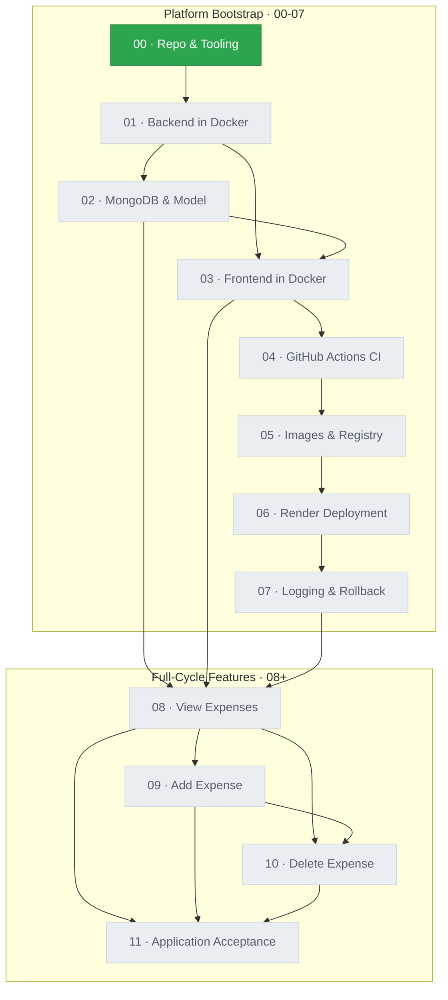
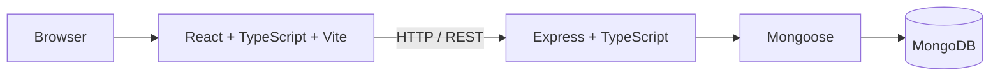
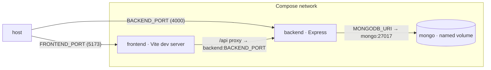
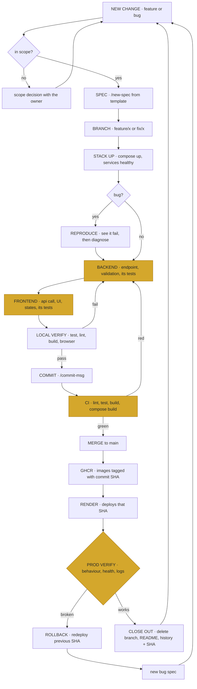

# Expense Tracker

A deliberately small MERN app used to learn the full development-to-deployment
lifecycle: Docker, Compose, CI/CD, a container registry and deployment to Render.

## Status

**1 of 12 complete.**

| #   | Feature                                | Status         | Deployed SHA |
| --- | -------------------------------------- | -------------- | ------------ |
| 00  | Repository & Tooling Setup             | ✅ Done        | —            |
| 01  | Backend in Docker                      | ⬜ Not started |              |
| 02  | MongoDB Service & Expense Model        | ⬜ Not started |              |
| 03  | Frontend in Docker                     | ⬜ Not started |              |
| 04  | GitHub Actions CI                      | ⬜ Not started |              |
| 05  | Production Images & Container Registry | ⬜ Not started |              |
| 06  | Render Deployment (CD)                 | ⬜ Not started |              |
| 07  | Logging & Rollback Drill               | ⬜ Not started |              |
| 08  | View Expenses                          | ⬜ Not started |              |
| 09  | Add Expense                            | ⬜ Not started |              |
| 10  | Delete Expense                         | ⬜ Not started |              |
| 11  | Application Acceptance                 | ⬜ Not started |              |

The Deployed SHA column is filled from feature 06 onward, when there is a
production deploy to record.

## Roadmap

Edges come from each spec's **Depends On** section.



## Architecture

The target design from `context/architecture.md`. Nothing runs yet — the
containers arrive in features 01-03.

Runtime flow:



Local container topology:



## Deployment Pipeline

Grey stages do not exist yet. They light up as features 04-06 land.

```mermaid
flowchart LR
    PUSH["git push"] --> GHA["GitHub Actions"]
    GHA --> CHECKS["lint · test · build"]
    CHECKS --> COMPOSE["compose build · dev + prod"]
    COMPOSE --> IMAGES["production images"]
    IMAGES --> GHCR["GHCR · main only · SHA + latest"]
    GHCR --> RENDER["Render deploys"]
    RENDER --> VERIFY["production verify · /api/health"]

    classDef done fill:#2da44e,stroke:#1a7f37,color:#ffffff
    classDef todo fill:#eaeef2,stroke:#d0d7de,color:#57606a
    class PUSH done
    class GHA,CHECKS,COMPOSE,IMAGES,GHCR,RENDER,VERIFY todo
```



## Getting Started

Not runnable yet — `docker compose up --build` arrives with feature 01, and this
section gains the real commands as each container lands.

Prerequisites: Docker and Docker Compose.

```bash
cp .env.example .env
```

The app runs only in containers: `docker compose up` starts it, and tests, lint,
format and build run through `docker compose exec`. There is no root
`package.json` and no host-level npm workflow.

## Environment Variables

Local values come from the root `.env`, copied from `.env.example`. It is
gitignored and never baked into an image. Production values live only in
Render's environment configuration.

| Variable        | Purpose                                    | Local (Compose `.env`)                         | Production (Render)                       |
| --------------- | ------------------------------------------ | ---------------------------------------------- | ----------------------------------------- |
| `NODE_ENV`      | Runtime mode for both apps                 | `development`                                  | `production`, set in Render (feature 06)  |
| `BACKEND_PORT`  | Port the backend (Express) is published on | `4000`                                         | Render environment (feature 06)           |
| `FRONTEND_PORT` | Port the frontend (Vite dev server) is on  | `5173`                                         | Render environment (feature 06)           |
| `MONGO_PORT`    | Port MongoDB listens on in the Compose net | `27017`, not published to the host             | Not used — separate database (feature 06) |
| `MONGODB_URI`   | Connection string the backend uses         | Points at the `mongo` service, never localhost | Separate production database (feature 06) |

## Tech Stack

- **Frontend** — React, TypeScript, Vite, Tailwind CSS, native `fetch`
- **Backend** — Node.js, Express, TypeScript, Mongoose, MongoDB
- **Testing** — Jest, React Testing Library, Supertest
- **Tooling** — ESLint, Prettier, npm, Git, GitHub
- **Infrastructure** — Docker, Docker Compose, GitHub Actions, GitHub Container
  Registry, Render

## Project Structure

```text
expense-tracker/
├── frontend/          # React app — empty until feature 03
├── backend/           # Express API — empty until feature 01
├── .github/           # CI workflows — empty until feature 04
├── context/           # project docs; features/ holds one spec per cycle
├── plan/              # early planning drafts
├── .claude/skills/    # workflow skills (implement-feature, commit-msg, ...)
├── .env.example       # committed list of environment variables
├── .nvmrc             # the pinned Node version, the only place it appears
├── .prettierrc        # shared formatting, with .prettierignore
├── .editorconfig
├── .gitattributes     # LF line endings on every OS
├── .gitignore
├── .dockerignore
├── CLAUDE.md
└── README.md
```

## Development Workflow

Every change runs the full cycle with `/implement-feature`. Amber steps wait
for review.



## Deployment & Rollback

Not set up yet. Render deployment arrives in feature 06, and the rollback
procedure — redeploying a previous image SHA — is written and practised in
feature 07.

## Build Log

### 00 — Repository & Tooling Setup

`7fe18bd` · merged in `ce6823c` (PR #1)

**Shipped** — the monorepo skeleton: `frontend/`, `backend/` and `.github/`
placeholders, `.gitignore`, `.dockerignore`, a commented `.env.example`, shared
Prettier and EditorConfig settings, and a placeholder README.

**Decisions** — Node `24.21.0` is pinned only in `.nvmrc`. `.gitattributes`
forces LF so a Windows checkout matches Prettier and the Linux containers. There
is no root `package.json`: `docker compose` is the entry point.

**Fixes** — `prettier --check .` failed on four committed docs (table alignment
only); `.claude/`, `context/` and `plan/` are now in `.prettierignore` as
hand-written docs.
